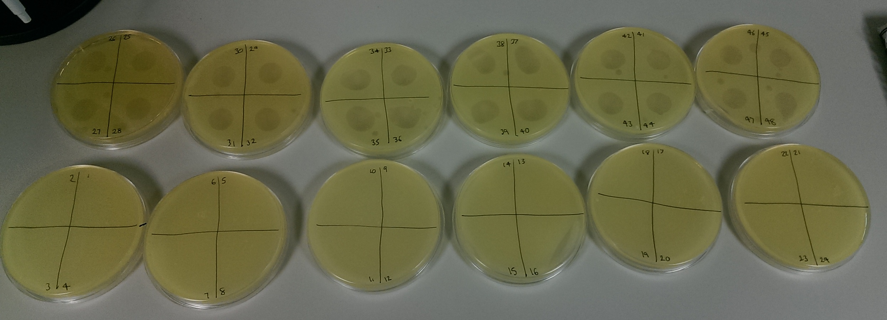

### 18/10/2017

- Autoclaved the soil again
- Autoclaved 1 L of DI millicule water
- Autoclaved 1 L of 0.6% soft agar
- Autoclaved a spoon to weigh out soil
- Got some $SBW25\phi2$ from Floh. Around 1 mL at 7.26 x 10^8^.
    - Grow up overnight
    - Transfer 60 µl of bacteria and 10 µl of phage (around 7 x 10 ^6^ pfus) into 6 mL of KB agar
    - Should give a concentration of around 10^8^ phage/mL
    - Done this in triplicate
- Grow up _lacZ_ and _WT_ strains overnight. Should give concentration of around ~10^8^ cells in 60 µl.
  - Do these in triplicate
  - Added 60 µL of frozen overnight culture from first experiment (18/08/2017 _lacZ_ and WT)
  
__Retrospectively work out density of the overnight stocks and phage__

### 19/10/2017

- Put 80g of soil into each 10cm x 10cm microcosm
    - Used autoclaved spoon
    - Placed scale in laminar flow hood (cleaned with ethanol before and after)
- Placed 5 mL (~ 200 µl per microcosm) of _lacZ_ and WT into separate 12 mL centrifuge tubes
    - Centrifuged for 15 minutes at max speed (~4500 r.p.m) on big centrifuge
    - Want to get to 5 mL per microcosm for inoculating (~ 125 mL in total)
    - Resuspended pellet into 2250 µl, vortexed and placed 620 µl, 620 µl and 810 µl into three different falcon tubes
    - Filled these three falcon tubes up to 40 mL, 40 mL and 45 mL respectively
        - This guaranteed the same concentration of sample in each falcon tube
    - Placed 5 mL of _lacZ_ or WT strain into each microcosm
    - Froze (-80 ºC) 900 µl of inoculate in 900 µl of glycerol (25% final concentration)
- In the no phage treatments, we added 5 mL of M9
- Added 5 mL  of phage to phage treatments
    - Place 900 µl of bacteria + phage into three centrifuge tubes
    - Add 100 µl (10%) chloroform into each tube (under fume hood)
    - Vortex rigorously
    - Centrifuge for 2-3 minutes at full speed (minifuge)
    - Take out supernatant and placed in a single tube (took out 800 µl of each tube)
    - Put 40 mL of M9 into 6 tubes
    - Added 400 µl into each tube (~100 fold dilution from the initial stock)
    - Shake each tube and add 5 mL into each microcosm
- Place microcosms into the 26 ºC incubator (Level 1 incubator room)

### 22/10/2017

- setup 2 WT microcosms up for spot assays of phage
- used a crystal from T~0~
- autoclaved 2 L of KB agar. Put in small autoclave

### 23/10/2017

- phage spot test 10~-1~ to 10~-8~
    - Floh's phage (7.26 x 10^8^)
    - Phage we inoculated with
    - Extra phage tube (should have lower concentration)
    - blank plate
- plated T~0~ of WT and _lacZ_ _P. fluorescens_

### 24/10/2017

- phage spot test was no good (streaky)
- likely that we did not wait long enough for the spot to dry
- set up more T~0~ bacteria overnight

### 25/10/2017

- phage spot assay again
- plating only 4 spots per plate instead of 8
- counted T~0~ counts (plated 30 µl)
    - _lacZ_ @ 10^-4^: 18
    - WT @ 10^-4^: 64
    
### 26/10/2017

- check phage spot, 10^-6^ looks to be the correct dilution
- further counts are done by putting the 10 µl phage into the 1% bacteria soft agar
    - vortex and plate
    - leave to dry
    - incubate overnight
    
### 30/10/2017

- grow up some T~0~ bacteria overnight

### 31/10/2017

- serial dilution of phage to 10^-6^
- 50 µl bacteria + 10 µl phage + 5 ml soft agar
    - vortex
    - pour
- set samples up for inoculated phage, floh's phage stock and our phage dregs (each in triplicate)
- in 28 ºC incubator overnight

### 01/11/2017

- looked at phage spots (10^-6^ dilution)
- calculated how many phage are there

$$ Phage\ concentration = \frac{number\ of\ plaques}{dilution\ factor\ \times\ volume added}$$

Volume added is almost always 10 µl. I wrote a mini function to calculate this

```{r, 20171102_phage}
d <- data.frame(dregs = c(3,4,6), phage = c(6,2,4))

# back calculate number in there
# PFU/ml = plaque number / (dil fac * volume added)
plaq_num <- function(x, dilfac){return(x/(dilfac*0.01))}

d <- dplyr::mutate_at(d, c('dregs', 'phage'), plaq_num, dilfac = 10^-6)

knitr::kable(d)

# concentration of phage added
mean(d$phage)

# concentration of other phage
mean(d$dregs)
```


- sampled all soil microcosms (after 13 days)
    - ~2g of soil into a 12 mL centrifuge tube (with ~ 7 glass beads)
        - sample using the big end of a 5 mL pipette and weigh on scales under hood
    - add 10 mL of M9
    - vortex for ~ 1 minute
    - add 900 µl of sample to 900 µl of 50% glycerol and freeze at -80 ºC (bacteria + phage)
    - make phage suspension for each tube
        - add 900 µl of sample to centrifuge tube
        - add 100 µl of chloroform under fume hood
        - vortex
        - centrifuge at full speed for 4 minutes
        - put supernatant into separate tube 
            - samples 1-17 800 µl, samples 18-48 750 µl
- names of samples
  - 1-12: WT no phage
  - 13-24: _lacZ_ no phage
  - 25-36: WT + phage
  - 37-48: _lacZ_ + phage
- Autoclaved things
    - 2 empty 500 mL bottles
    - M9 salts x10 (500 mL)
        - converted the weight of $Na_{2}HPO_{4}$ to the amount of $Na_{2}HPO_{4}.7H_{2}O$ needed.
        - MW of $Na_{2}HPO_{4}.7H_{2}O$ is 268. MW of $Na_{2}HPO_{4}$ is 142. 
        - to convert from weight of $Na_{2}HPO_{4}$ to $Na_{2}HPO_{4}.7H_{2}O$ is to multiply by $\frac{268}{142}$
    - 1 L of DI water
    - 2 L hard agar
    - centrifuge tubes.
    
```{r, 20171102_weight, echo = FALSE}
d <- data.frame(sample = c(1:48), weight_g = c(2.1, 2.0, 1.9, 2.0, 2.0, 2.0, 2.0, 2.0, 2.1, 1.9, 2.2, 2.1, 2.1, 1.9, 2.2, 2.2, 1.9, 2.2, 2.0, 2.3, 2.3, 2.2, 1.9, 2.1, 2.1, 2.2, 1.9, 2.0, 2.2, 2.3, 2.0, 2.2, 2.2, 2.2, 2.0, 2.0, 2.3, 1.9, 2.2, 1.9, 2.2, 2.0, 2.0, 2.2, 2.1, 2.2, 2.2, 2.1))

knitr::kable(d)
```
        
### 02/11/2017

- set up phage spot tests of all soil phage suspensions against ancestral WT on soft agar.
    - just checking for presence/absence of phage
    - 5 mL per plate, 4 spots per plate, 12 spots in total
    - important to let the spot dry before moving
- poured plates (all Xgal)

### 03/11/2017

- all no phage treatments had no phage and all phage treatments had phage
- plated all the bacteria + phage treatments at 10^-4^ and 10^-5^ (30 µl)
    - left on bench over the weekend
    
### 06/11/2017

- counted all the plates
    - all still had bacteria in and were not obviously contaminated (Yays)
- picked 20 colonies from each sample and placed in KB media in 48 well plates
    - 750 µl of KB media
    - used matchsticks
- grown statically for 2 days at 26 ºC

### 08/11/2017

- put 500 µl of 50% glycerol into each well (final concentration 20%)
- froze in the -80 ºC
- autoclaved
    - 2x 800 mL hard agar
    - 2x 800 mL soft agar

### 13/11/2017

- prep for sampling soil microcosms tomorrow. Labelled samples. Booked downstairs hood with power access.

### 14/11/2017

- sampled all 48 microcosms
- froze 900 µl of bacteria + phage in 900 µl of 50% glycerol (final concentration equals 25%)
- phage sample in fridge
    - 1-12: 750 µl
    - 13-48: 600 µl
- setup soft agar plates of ancestral bacteria and did phage spot assays

```{r, 20171114_weight, echo = FALSE}
d <- data.frame(sample = c(1:48), weight_g = c(2.2, 2.2, 2.3, 2.1, 2.2, 2.1, 2.1, 2.0, 2.0 ,2.0, 2.2, 2.1, 2.0, 2.2, 2.2, 2.0, 2.1, 2.3, 2.0, 2.0, 2.1, 2.0, 2.1, 2.2, 2.0, 2.0, 2.2, 2.0, 2.0, 2.0, 2.3, 2.1, 2.2, 2.2, 2.1, 2.1, 2.1, 2.3, 2.0, 2.0, 2.3, 2.0, 2.2, 2.2, 2.0, 2.2, 2.0, 2.0))

knitr::kable(d)
```

### 15/11/2017

- all phageless samples are still phageless, all phage samples still contain phage

### 16/11/2017

- plated all T~2~ samples
    - 10^-3^ and 10^-4^
    - 30 µl of on plate
- __used undiluted M9 x10 on Tuesday!!!__
- made up 400 mL of M9 salts x10 for autoclave    

### 20/11/2017

- counted plates.
    - Most are ok at 10^-3^. Counts were much lower. Want to be certain that the reduction in abundance is not due to using concentrated M9.
- full sample again, T~3~.
    - Took 700 µL samples of phage
- setup overnight stock of ancestral bacteria
- autoclaved 2400 mL of KB agar

```{r, 20171120_weight, echo = FALSE}
d <- data.frame(sample = c(1:48), weight_g = c(2, 2, 1.9, 2.3, 2, 2.2, 2, 2.3, 2, 2.1, 2.2, 2.1, 2, 2.1, 2, 2.3, 2.3, 2.1, 2.2, 2, 2.1, 2.1, 2.1, 2.2, 2.1, 2, 2.2, 2.1, 2.1, 2, 2.2, 2, 2.1, 2.1, 2.2, 2.2, 2, 2.1, 2.1, 2, 2.1, 2.2, 2, 2.3, 2.2, 2.1, 2.1, 2))

knitr::kable(d)
```

### 21/11/2017

- plated all 48 T~3~ samples at 10^-2^ and 10^-3^
- re-plated all T~2~ replicates that did not contain > 20 colonies at 10^-2^
- poured ~150 Xgal plates. Stored in the cold room
- autoclaved two boxes of ependorfs
- put beads in Virkon to clean
- phage spot assay on phage extractions from T~3~. Used ancestral bacteria as the bacterial lawn

### 23/11/2017

- all T~3~ samples were ok (> 30 colonies at 10^-3^) apart from 12 and 37
    - 12 an 37 were re-plated at 10^0^ and 10^-1^
- picked 20 colonies from each sample and placed in KB media in 48 well plates
    - 750 µl of KB media
    - used matchsticks
- grown statically for 2 days at 26 ºC
- Checked phage spot assays



### 25/11/2017

- picked colonies from 12 (10^0^) and 37 (10^-1^)
    - incubate for two days
- put 500 µl of 50% glycerol into each well of the other replciates that had been growing for two days (final concentration 20%)
- froze in the -80 ºC